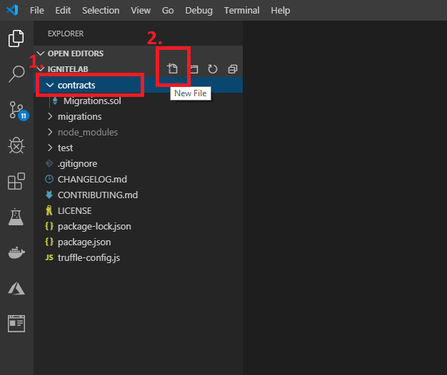
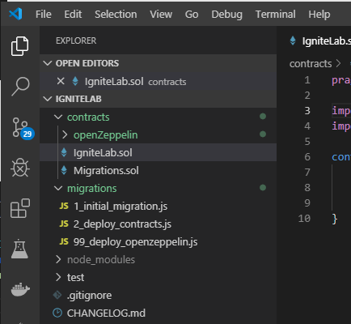
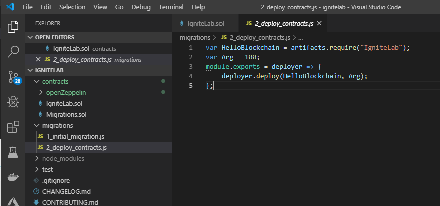

# Story 1: Download an ERC-20 token

## Step 1 - Create a workspace

- Once logged into your VM create an empty directory on the machine and start VS Code

  - From a command prompt type:
    ```
    mkdir c:\ignitelab
    ```
    
    ```
    cd c:\ignitelab
    ```
    
    ```
    code .
    ```
    
    

  

  ## Step 2 - Connect Azure to your VS Code environment

- Once VS Code launches, you need to log into Azure by selecting the Azure charm as shown below

  

- In the `integration accounts` pane you can then login using the following credentials:

  - Username: labuser@igndemo.onmicrosft.com
  - Password: L@b4Ign!te!

- Once logged in, return to the explorer view by selecting the explorer charm

  

  ## Step 3 - Setup your directory 

- You are now ready to scaffold out a basic solidity project. From VS Code menu select, `view, command palette` and in the drop down type `azure blockchain:` and select `New Solidity Project` 

- Choose basic project from the drop down and then select your `c:\ignitelab` as the project directory. This will download and create a new project for you. Note: this will take a few minutes (there is a spinning icon with "Creating new project" at the bottom left of the VS Code window which will disappear at the end of the process)

  

- Once completed your directory will look something like this:

  

- `In this lab, we will not use the HelloBlockchain.sol contract` that is downloaded in the c:\ignitelab\contracts directory. `Right click on the file and hit delete` (or just use the delete key on your keboard)

- Add a new file to the project and title it `IgniteLab.sol` by clicking on the new file icon at the top of the project explorer in VS code

  `Note: make sure you are adding this file into the "contracts" directory. You can ensure this by first clicing on the contracts tab, then adding the file`

  


- In this new file cut and paste the following code and hit save (ctrl-s)

  ```
  pragma solidity ^0.5.0;
  
  import "./openZeppelin/token/ERC20/ERC20.sol";
  import "./openZeppelin/token/ERC20/ERC20Detailed.sol";
  
  contract IgniteLab is ERC20, ERC20Detailed {
      constructor(uint256 initialSupply) ERC20Detailed("Ignite", "IGNTE", 18) public {
          _mint(msg.sender, initialSupply);
      }
  }
  ```

  ## Step 4: Download and integrate your OSS ERC20 token

- Now that you have a basic project and directory structure, you need to download the ERC-20 token from OpenZeppelin

- In the VS Code editor, click on the `contracts` folder, left click on the "IgniteLab.sol" file

- After selecting the .sol file, `right click` on the contract and you will see a context menu which will allow you to download OpenZeppelin Contracts

  

- After selecting `Add contracts from OpenZeppelin` then chose the `Tokens/ERC-20` token

  

- This will then download the ERC20 token from OpenZeppelin and update your project settings. Once complete your directory will contain a new folder `openZeppelin` with the contract/token files inside

  

- In this lab, we are only going to use a subset of functionality of the OpenZeppelin smart contracts. In this case, need to make some modifications to the `migrations` directory.

- Open the migrations directory as shown below

  

- `delete` the file "99_deploy_openzeppelin.js" file

- Now `edit` the file "2_deploy_contracts.js" file to match the code below

```
var HelloBlockchain = artifacts.require("IgniteLab");
var Arg = 100;
module.exports = deployer => {
    deployer.deploy(HelloBlockchain, Arg);
};
```

- This will set the total number of tokens you can mint. In this case you can mint 100, but you may change the value of Arg to any number you wish.

- Save the changes to your "2_deploy_contracts.js" file. Your directory and "2_deploy_contracts.js" should look like this

  

- At this point you have downloaded a popular OSS implementation of an ERC20 and integrated that contract into an environment that is ready to deploy.


`This completes user story 1: Downloading and integrating an OSS ERC20 token`

`Note: if you cannot finish this section on your own, a completed section is available in this GitHub repo under the story1/solution directory. The node_modules dirctory created in step 3 above will need to be copied into this solution as well` 

### [You may now  move on to Step 2 - Deploy and Interact with your contract locally](../story2/story2.md)

