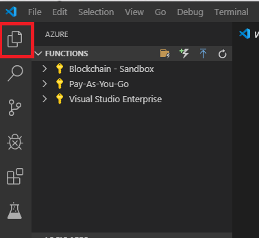
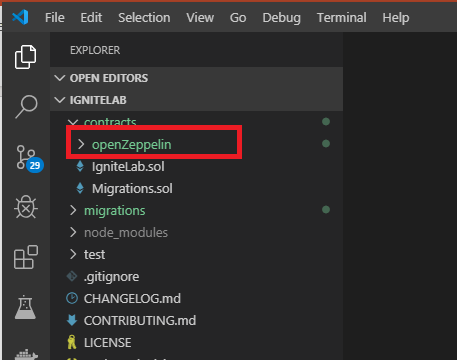

# Story 1: Download an ERC-20 token

## Step 1 - Create a workspace

- Once logged into your VM create an empty directory on the machine and start VS Code

  - From a command prompt type:
    ```
    mkdir c:\ignitelab
    ```
    
    ```
    cd c:\ignitelab
    ```
    
    ```
    code .
    ```
    
    

  

  ## Step 2 - Connect Azure to your VS Code environment

- Once VS Code launches, you need to log into Azure by selecting the Azure charm as shown below

  

- In the `integration accounts` pane you can then login using the following credentials:

  - Username: TBD
  - Password: TBD

- Once logged in, return to the explorer view by selecting the explorer charm

  

  ## Step 3 - Download an OSS ERC20 token

- You are now ready to scaffold out a basic solidity project. From VS Code menu select, `view, command palette` and in the drop down type `azure blockchain:` and select `New Solidity Project` 

- Choose basic project from the drop down and then select your `c:\ignitelab` as the project directory. This will download and create a new project for you. Note: this will take a few minutes (there is a spinning icon with "Creating new project" at the bottom left of the VS Code window which will disappear at the end of the process)

  

- Once completed your directory will look something like this:

  

- Now that you have a basic project and directory structure, you need to download the ERC-20 token from OpenZeppelin

- In the VS Code editor, click on the `contracts` folder, left click on the "helloblockchain.sol" file

- After selecting the .sol file, `right click` on the contract and you will see a context menu which will allow you to download OpenZeppelin Contracts

  

- After selecting `Add contracts from OpenZeppelin` then chose the `Tokens/ERC-20` token

  

- This will then download the ERC20 token from OpenZeppelin and update your project settings. Once complete your directory will contain a new folder `openZeppelin` with the contract/token files inside

  

- To integrate the OpenZeppelin ERC20 token into your smart contract DO THE FOLLOWING --- TBD

`This completes user story 1: Downloading and integrating an OSS ERC20 token`

`Note: if you cannot finish this section on your own, a completed section is available under c:\ignite\story1`


### [You may now  move on to Step 2 - Deploy and Interact with your contract locally](../story2/story2.md)