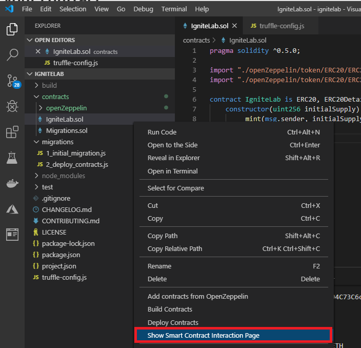

# Story 2: Deploy and interact with token locally

At the end of story 1 you had scaffolded out a development environment, downloaded, and integrated a OSS ERC20 token into your workspace. In this section, we will build, deploy, and interact with this token on ledger on your local machine. 

## Step 1 - Compile and deploy the token

- To build a project, `right click` on any solidity (.sol) file in your solution and select "Build Contracts" from the drop down

  

- Once completed you will have a new directory in your workspace titled "build" - This directory includes all of the build process metadata including contract ABI, Bytecode etc.

## Step 2 - Deploy the contract locally

- After the build process completes, `right click` on any Solidity file (.sol) in your project and select "Deploy Contracts" from the dropdown menu

- After selecting "Deploy Contracts" select `development 127.0.0.1:8545` from the selection options

  

- This starts the process of deploying a contract a local (emulated) ledger

- Once this process completes you will see information from the deployment including estimated (virtual) gas costs, contract address etc. This information is available in the output channel for Azure Blockchain (bottom right of the VS Code window as shown below)

  `Note: your values will be different than shown below`

  

## Step 3 - Interact with your contract 

Now that you have deployed a contract locally, you can auto-generate UI through the VS Code extension which gives developers an easy way to test out their contract functionality. To generate this UI:

- `Right click` on any of the Solidity (.sol) files in your project and select "Show Contract Interaction Page"

  

- Once the Contract UI page loads you may test out various parts of your contract - TODO

`This completes user story 2: Deploy and Interact with your contract locally`

`Note: if you cannot finish this section on your own, a completed section is available under c:\ignite\story2`

### [You may now  move on to Step 3 - Deploy to Azure Blockchain Service and create microservices for your smart contract](../story3/story3.md)

