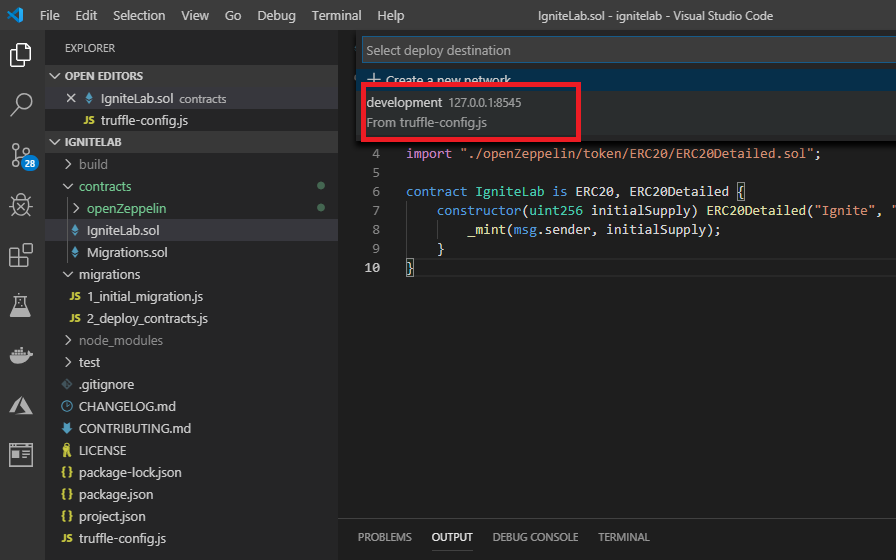

# Story 2: Deploy and interact with token locally

At the end of story 1 you had scaffolded out a development environment, downloaded, and integrated a OSS ERC20 token into your workspace. In this section, we will build, deploy, and interact with this token on ledger on your local machine. 

## Step 1 - Compile and deploy the token

- To build a project, `right click` on any Solidity (.sol) file in your solution and select "Build Contracts" from the drop down

  

- Once completed you will have a new directory in your workspace titled "build" - This directory includes all of the build process metadata including contract ABI, Bytecode etc.

## Step 2 - Deploy the contract locally

- After the build process completes, `right click` on any Solidity file (.sol) in your project and select "Deploy Contracts" from the dropdown menu

- After selecting "Deploy Contracts" select `development 127.0.0.1:8545` from the selection options

  

- This starts the process of deploying a contract a local (emulated) ledger

- Once this process completes you will see information from the deployment including estimated (virtual) gas costs, contract address etc. This information is available in the output channel for Azure Blockchain (bottom right of the VS Code window as shown below)

  `Note: your values will be different than shown below`

  

## Step 3 - Interact with your contract 

In this section, we will briefly interact with our contract via a script. Developers often use scripts to test, interact, or do various actions with contracts, this is an example of how easy to interact with a scripting environment directly from the VS Code editor. 

To create a simple interaction script do the following

- Click on any file at the root of your project directory (this ensures that the next step will place a file in an easy to remember location - technically you may put this file anywhere)

  

- Next add a file to the project titled `validate.js` - you add a file in the same way as the previous story. Click on the Icon shown below and enter the file name

  

- Next open the file (by left clicking on the file in the tree view) and add the following code to it

  ```
  const IgniteLab = artifacts.require('IgniteLab');
  
  module.exports = async (done) => {
      console.log('Getting deployed version of IgniteLab Token');
  
      let _meta;
      let testout = await web3.eth.getAccounts();
      const _owner = testout[0];
      const _recipient = testout[1];
      let _amount = 45;
  
      IgniteLab.deployed().then(function(instance){
          console.log("Getting the current balance for source account...");
          _meta = instance;
          return _meta.balanceOf.call(_owner);
      }).then(function(ownerBalanceResult){
          console.log("Initial owner balance: " + ownerBalanceResult.toNumber());
          return _meta.balanceOf.call(_recipient);
      }).then(function(recipientBalanceResult){
          console.log("Initial recipient balance: " + recipientBalanceResult.toNumber());
          console.log("Transferring " + _amount + " to recipient");
          return _meta.transfer(_recipient, _amount);
      }).then(function(transferTxResult){
          return _meta.balanceOf.call(_owner);
      }).then(function(ownerFinalBalanceResult){
          console.log("Final owner balance: " + ownerFinalBalanceResult);
          return _meta.balanceOf.call(_recipient);
      }).then(function(recipientFinalBalanceResult){
          console.log("Final recipient balance: " + recipientFinalBalanceResult.toNumber());
      });
  };
  ```

- your directory and file should look something like this

  

- Save this file (ctrl-s)

- To execute this JavaScript file, get to the command line in VS Code by clicking on the `terminal` tab in the editor as shown below

  

- Now place your cursor in the window next to the C:\ignitelab> prompt and type the following command

  ```javascript
  truffle exec validate.js
  ```

- This command invokes the truffle command line tool and asks it to execute the file validate.js

- You should see the validate.js file execute and send output to the screen as shown below

  

- In this story, you deployed a token contract locally, and briefly interacted with the contract through a JavaScript file you created and used `truffle exec` to test
- Typically in the development cycle, the next step are to deploy this contract to a cloud ledger (or public if you are developing for public blockchain). In the next story, you will take this same contract and deploy it to Azure Blockchain Service, then quickly generate a set of microservices to allow repeated access to contract functions (like token transfer from above)

`This completes user story 2: Deploy and Interact with your contract locally`

`Note: if you cannot finish this section on your own, a completed section is available under c:\ignite\story2`


### [You may now  move on to Step 3 - Deploy to Azure Blockchain Service and create microservices for your smart contract](../story3/story3.md)

