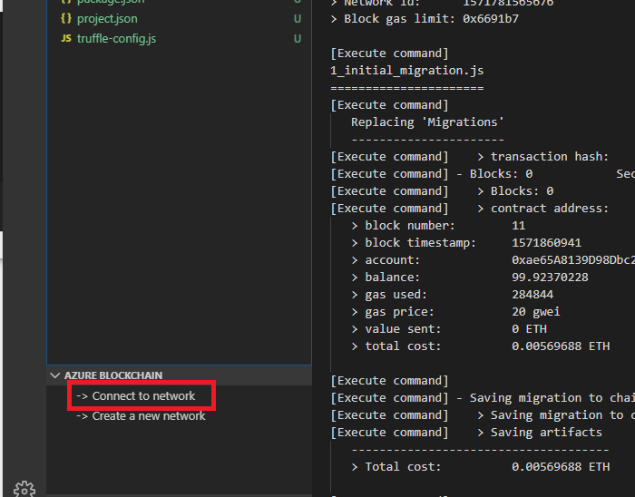

# Story 3 - Deploy to Azure Blockchain Service and create microservices for your smart contract

At the end of story 2 you had deployed your contract locally and had some experience interacting with it through a simple script. In this story, we extend that scenario to deploy this contract to a ledger in the Azure Blockchain Service. Once deployed we will then use the VS Code extension to create a set of microservices for each function in your contract. These microservices, based on Azure Logic Apps, are a simple way to exercise functions on your smart contract in Azure. The exercising of, and reporting the response back, from your smart contract can then be plumbed back into any enterprise application, LoB UI or process (not a goal of this lab) demonstrating how you can then interact with contracts deployed in a private blockchain network

## Step 1: Connect to an Azure Blockchain Service in VS Code

If you did not have a Azure Blockchain Service (ABS) instance already created, you could create on through the VS Code extension. However, to save time, we have created one for you. To connect to this instance use the following steps.

- In the lower left hand pane of your VS Code extension, `left click on` (expand the Azure Blockchain tab if necessary) `-> Connect to network` as shown below

  

- After selecting, select the `Azure Blockchain Service` from the drop down

  

- Select the subscription and resource groups from the drop down

- Once completed, you will see an `Azure Blockchain Service` connection has been added to your resource tree (this connects the VS Code extension, to the actual ABS resource deployed in Azure)

  

## Step 2 - Deploy your contract/token to Azure Blockchain Service

- `Right click` on the `IgniteLab.sol` file in your solution and select "Deploy Contract"

- Select the entry that starts with `abs_` from the drop down (note your connection may have a different string after than abs_ then shown here)

  

- On the next drop down, select `generate mnemonic`

  

- After selecting the `generate mnemonic` option above, you will get a file save box - Name the file anything you wish and save the mnemonic .env file anywhere on the C:\ drive

- This begins the process of deploying your contract/token to the Azure Blockchain Service you connected in step 1

- Once complete, you will find similar metadata in the output window as you saw when deploying a contract locally in story 2 (i.e., contract address etc) - you may have to go back to the `output` tab in VS Code to see the deployment information if you are still in the terminal tab from story 2

  

- At this point, you have deployed the ERC20 token to Azure Blockchain Service. In the previous exercise we created a simple script to interact with the contract, but that script is limited - you cannot easily change transfer quantity, recipients etc. In real life a developer must provide more generic input/ouput capabilities for contract interaction. Our VS Code extension provides a simple way to create this generic input/output service via logic apps. We will create that service in the next step and use it in story 4

  ## Step 3 - Generate Microservices for your token

We now have some insight into how a token is created, deployed and what sort of actions (e.g., transfer) can be taken against the token. In this step we will use the VS Code extension to create a set of general purpose microservices which can be used to exercise all contract functions. These services are implemented as logic apps in this example. 

To generate a set of logic apps for this token use the following steps.

- `Right click on your IginiteLab.sol` and select `Generate Microservices for Smart Contracts` from the menu

  

- After selecting the option to chose microservices, then select `Logic App` from the drop down

  

- After selecting the logic app option, you will be asked to provide some basic information about where this logic app will reside (e.g., what subscription, resource group and which contract address is it targeting)

- You may find the deployed contract address by scrolling through the output information from step 2 above. You should not have to scroll far, but please make sure to get the contract address from the last `IgniteLab` contract deployment as shown below (note: not the migration contract deployment)

  

- Select the Azure subscription and resource group that your Azure Blockchain instance is deployed to

- Once complete, you will see a new directory in your project titled `generatedLogicApp`

  

- Expand the generatedLogicApp folder, you should see several .json files - these files are a series of microservices for your contract which we will explore in story 4. 

  

- `This completes user story 3: Deploy to Azure Blockchain Service and create microservices for your smart contract`

  `Note: if you cannot finish this section on your own, a completed section is available under c:\ignite\story3`

  

  ### [You may now  move on to Step 4 - Create, setup and exercise the Logic App in Azure](../story4/story4.md)
