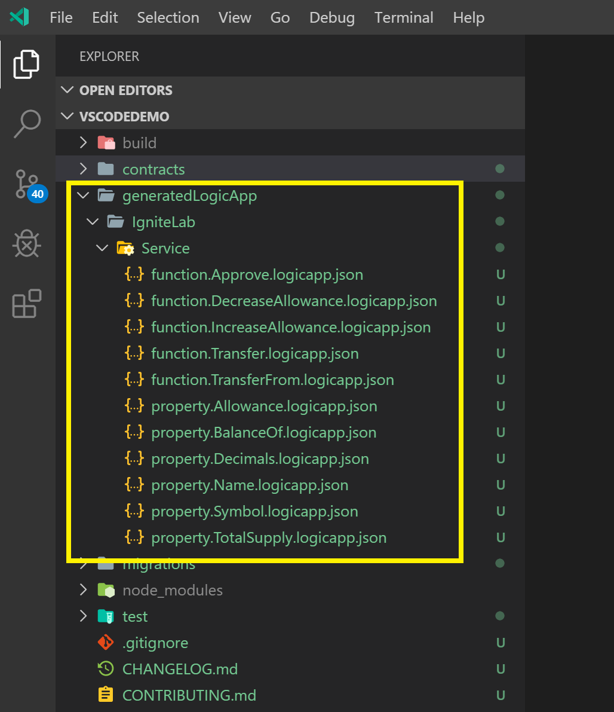

# Story 4 - Create, setup and exercise the Logic App in Azure

At the end of story 3 you had deployed the token to the Azure Blockchain Service and you have created the microservice script that will be used to create the Logic App in Azure.  In this story, we will extend on that and actually create the Logic App as well as exercise the contract by using simple tooling in VS Code.

## Step 1: Create a new Logic App in Azure

A new logic app will need to be created, that will receive the microservice script from the previous story.  To do this first login the Azure management portal.

URL: https://portal.azure.com
USER: labuser@igndemo.onmicrosoft.com
PASS: L@b4Ign!te!

- After logging, in navigate to the single resource group available here, `ctignrg1`.

- Next create a new Logic App inside this resource group.

  - First, click the `Add` button inside the resource group.

    

  - In the `Search the marketplace` box, type `Logic App` and pick the first entry in the results.

    

  - Next click `Create` in start the creation of the Logic App
   
    

  - A set of parameters will be presented used to create the Logic App.  Use the following parameters:

    - `Name`: `ignlab + <your workstation number>`  (e.g. ign1 for workstation 1, ign2 for workstation 2)
    - `Subscription`: `Leave this to the default AzureMSDN`
    - `Resource Group`: `Use existing and use ctignrg1`
    - `Location`: `West US`
    - `Log Analytics`: `Leave this to the default Off`
    - CLick create button to create

  - The creation of the Logic App will take < 1 min.  You can check if the deployment is completed by clicking on the `bell` icon on the Dashboard in the Azure management portal.  Click on `Go to resource` to configure the logic app.

    

## Step 2: Setup the Logic App using the code generated from VS Code.

Now that an empty Logic App has been created in resource group, the microservice code generated from VS Code can be imported to this new application, to avoid having to manually setup the connectors.

  - To start, go back to VS Code and navigate to the project created in story3, and navigate to the generatedLogicApp folder.  A subfolder with the name of the smart contract, IgniteLab will exist with the generated code.  Select the first one, and copy this by clicking the details pane in VS Code, pressing <CTRL + A> and then <CTRL + C>.

  

  - Now go back to the Logic App in the Azure management portal.  Click on Blank Logic App.

  

  - Next click on Code View and remove the existing code.  Paste the code from your generated app in here (CTRL + V).

  

  - Click save.

  

## Step 3: Exercise the Logic App

