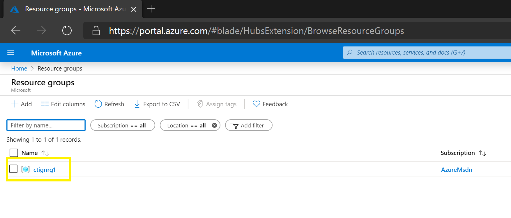
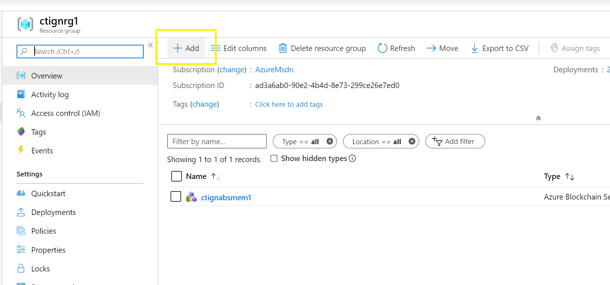
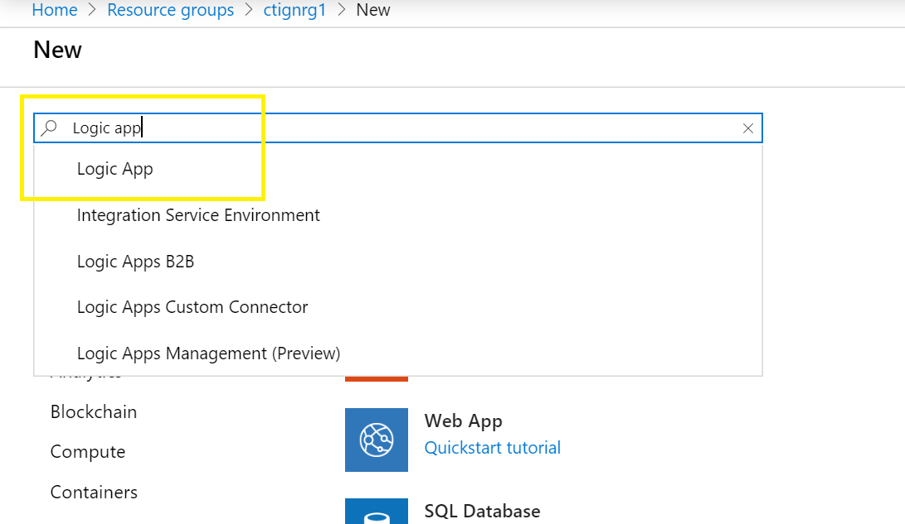
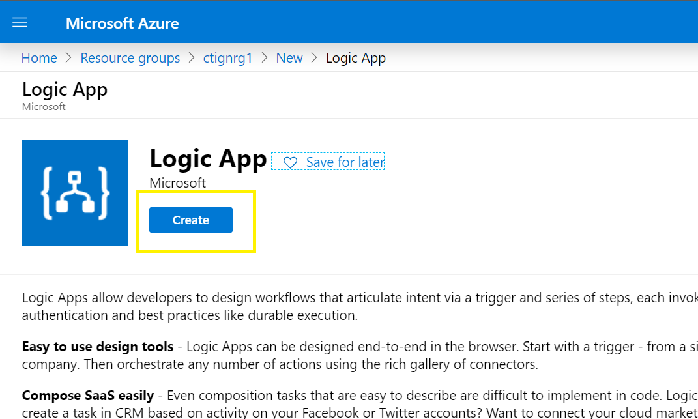
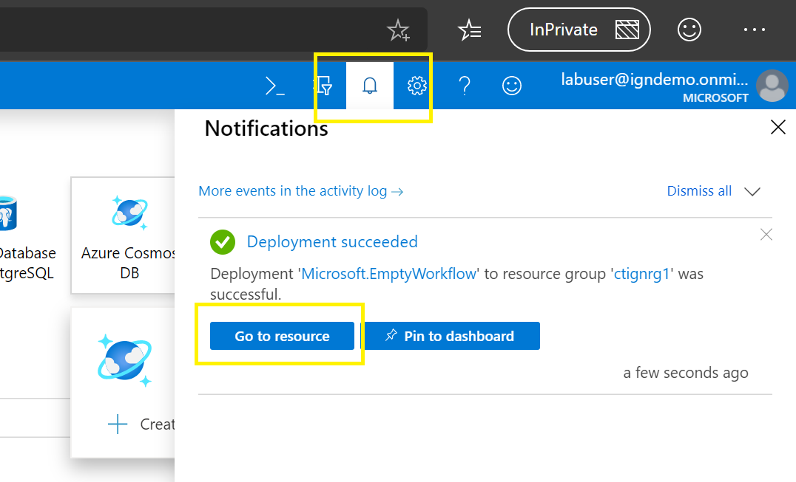
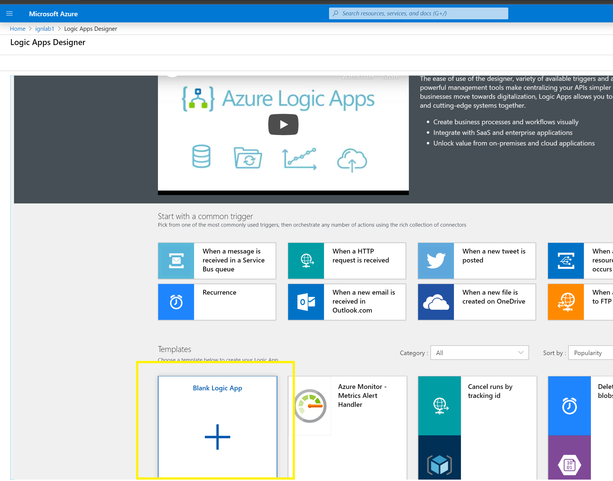
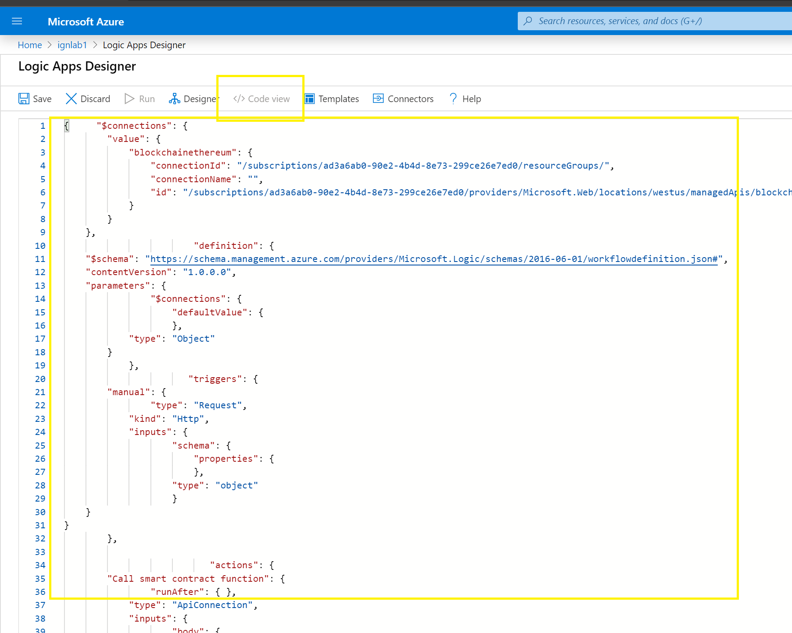
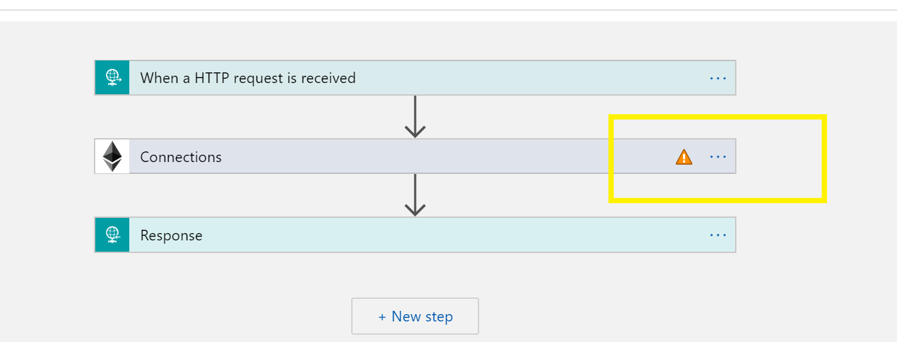
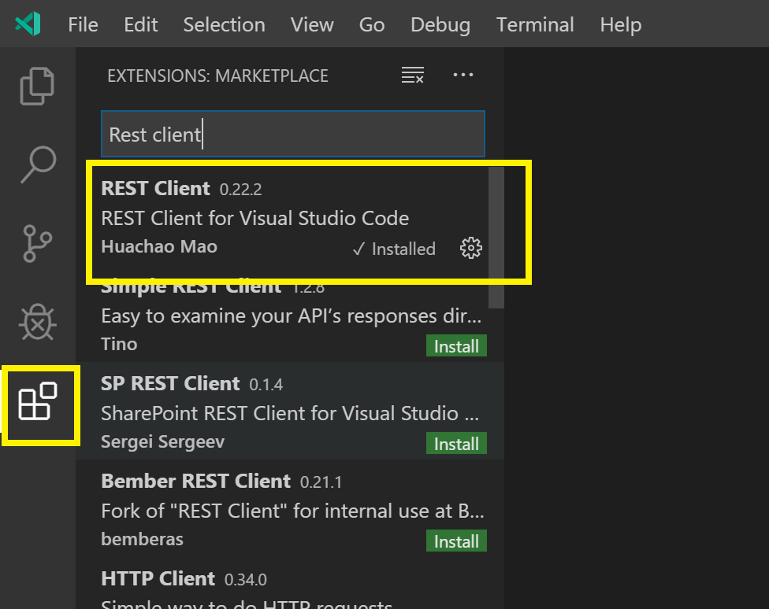
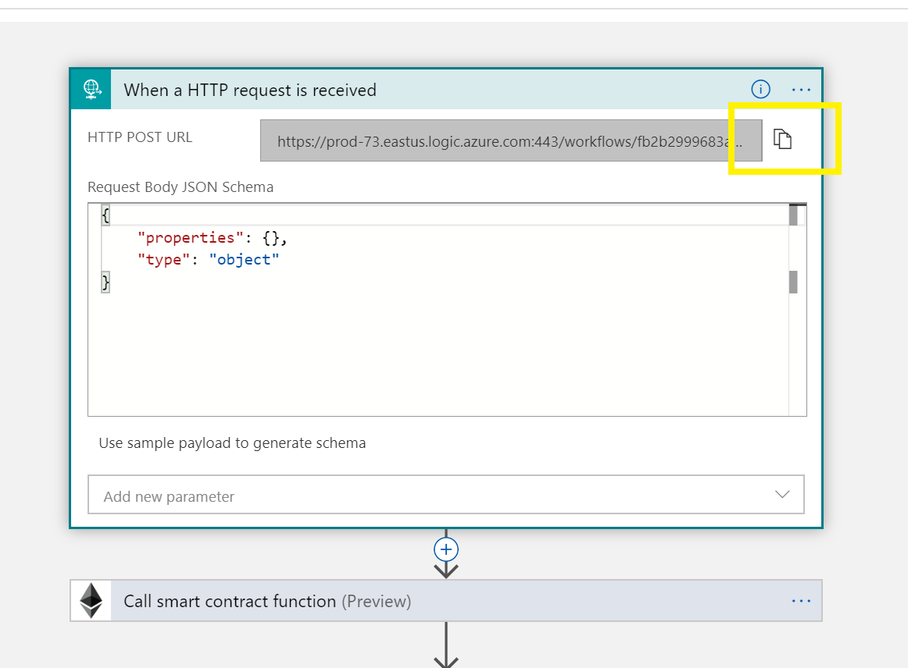

# Story 4 - Create, setup and exercise the Logic App in Azure

At the end of story 3 you had deployed the token to the Azure Blockchain Service and you have created the microservice script that will be used to create the Logic App in Azure.  In this story, we will extend on that and actually create the Logic App as well as exercise the contract by using simple tooling in VS Code.

## Step 1: Create a new Logic App in Azure

A new logic app will need to be created, that will receive the microservice script from the previous story.  To do this first login the Azure management portal.

URL: https://portal.azure.com
USER: labuser@igndemo.onmicrosoft.com
PASS: L@b4Ign!te!

- After logging, in navigate to the single resource group available here, `ctignrg1`.



- Next create a new Logic App inside this resource group.

  - First, click the `Add` button inside the resource group.

    

  - In the `Search the marketplace` box, type `Logic App` and pick the first entry in the results.

    

  - Next click `Create` in start the creation of the Logic App
   
    

  - A set of parameters will be presented used to create the Logic App.  Use the following parameters:

    - `Name`: `ignlab + <your workstation number>`  (e.g. ign1 for workstation 1, ign2 for workstation 2)
    - `Subscription`: `Leave this to the default AzureMSDN`
    - `Resource Group`: `Use existing and use ctignrg1`
    - `Location`: `West US`
    - `Log Analytics`: `Leave this to the default Off`
    - CLick create button to create

  - The creation of the Logic App will take < 1 min.  You can check if the deployment is completed by clicking on the `bell` icon on the Dashboard in the Azure management portal.  Click on `Go to resource` to configure the logic app.

    

## Step 2: Setup the Logic App using the code generated from VS Code.

Now that an empty Logic App has been created in resource group, the microservice code generated from VS Code can be imported to this new application.  To simplify this, an logic app has been included here.  Copy this (CTRL + C).

```
{
    "parameters": {
        "$connections": {
            "value": {
                "blockchainethereum": {
                    "connectionId": "/subscriptions/276a38ca-eaf4-4dc3-bacd-3003c9c52ff2/resourceGroups/",
                    "connectionName": "",
                    "id": "/subscriptions/276a38ca-eaf4-4dc3-bacd-3003c9c52ff2/providers/Microsoft.Web/locations/eastus/managedApis/blockchainethereum"
                }
            }
        }
    },
    "definition": {
        "$schema": "https://schema.management.azure.com/providers/Microsoft.Logic/schemas/2016-06-01/workflowdefinition.json#",
        "contentVersion": "1.0.0.0",
        "parameters": {
            "$connections": {
                "defaultValue": {},
                "type": "Object"
            }
        },
        "triggers": {
            "manual": {
                "type": "Request",
                "kind": "Http",
                "inputs": {
                    "schema": {
                        "properties": {
                            "account": {
                                "type": "string"
                            }
                        },
                        "type": "object"
                    }
                }
            }
        },
        "actions": {
            "Call smart contract function": {
                "runAfter": {},
                "type": "ApiConnection",
                "inputs": {
                    "body": {
                        "account": "@triggerBody()?['account']"
                    },
                    "host": {
                        "connection": {
                            "name": "@parameters('$connections')['blockchainethereum']['connectionId']"
                        }
                    },
                    "method": "post",
                    "path": "/contract/functions/@{encodeURIComponent(encodeURIComponent('balanceOf'))}/query",
                    "queries": {
                        "abi": "[{\"constant\":true,\"inputs\":[],\"name\":\"name\",\"outputs\":[{\"name\":\"\",\"type\":\"string\"}],\"payable\":false,\"stateMutability\":\"view\",\"type\":\"function\"},{\"constant\":false,\"inputs\":[{\"name\":\"spender\",\"type\":\"address\"},{\"name\":\"value\",\"type\":\"uint256\"}],\"name\":\"approve\",\"outputs\":[{\"name\":\"\",\"type\":\"bool\"}],\"payable\":false,\"stateMutability\":\"nonpayable\",\"type\":\"function\"},{\"constant\":true,\"inputs\":[],\"name\":\"totalSupply\",\"outputs\":[{\"name\":\"\",\"type\":\"uint256\"}],\"payable\":false,\"stateMutability\":\"view\",\"type\":\"function\"},{\"constant\":false,\"inputs\":[{\"name\":\"sender\",\"type\":\"address\"},{\"name\":\"recipient\",\"type\":\"address\"},{\"name\":\"amount\",\"type\":\"uint256\"}],\"name\":\"transferFrom\",\"outputs\":[{\"name\":\"\",\"type\":\"bool\"}],\"payable\":false,\"stateMutability\":\"nonpayable\",\"type\":\"function\"},{\"constant\":true,\"inputs\":[],\"name\":\"decimals\",\"outputs\":[{\"name\":\"\",\"type\":\"uint8\"}],\"payable\":false,\"stateMutability\":\"view\",\"type\":\"function\"},{\"constant\":false,\"inputs\":[{\"name\":\"spender\",\"type\":\"address\"},{\"name\":\"addedValue\",\"type\":\"uint256\"}],\"name\":\"increaseAllowance\",\"outputs\":[{\"name\":\"\",\"type\":\"bool\"}],\"payable\":false,\"stateMutability\":\"nonpayable\",\"type\":\"function\"},{\"constant\":true,\"inputs\":[{\"name\":\"account\",\"type\":\"address\"}],\"name\":\"balanceOf\",\"outputs\":[{\"name\":\"\",\"type\":\"uint256\"}],\"payable\":false,\"stateMutability\":\"view\",\"type\":\"function\"},{\"constant\":true,\"inputs\":[],\"name\":\"symbol\",\"outputs\":[{\"name\":\"\",\"type\":\"string\"}],\"payable\":false,\"stateMutability\":\"view\",\"type\":\"function\"},{\"constant\":false,\"inputs\":[{\"name\":\"spender\",\"type\":\"address\"},{\"name\":\"subtractedValue\",\"type\":\"uint256\"}],\"name\":\"decreaseAllowance\",\"outputs\":[{\"name\":\"\",\"type\":\"bool\"}],\"payable\":false,\"stateMutability\":\"nonpayable\",\"type\":\"function\"},{\"constant\":false,\"inputs\":[{\"name\":\"recipient\",\"type\":\"address\"},{\"name\":\"amount\",\"type\":\"uint256\"}],\"name\":\"transfer\",\"outputs\":[{\"name\":\"\",\"type\":\"bool\"}],\"payable\":false,\"stateMutability\":\"nonpayable\",\"type\":\"function\"},{\"constant\":true,\"inputs\":[{\"name\":\"owner\",\"type\":\"address\"},{\"name\":\"spender\",\"type\":\"address\"}],\"name\":\"allowance\",\"outputs\":[{\"name\":\"\",\"type\":\"uint256\"}],\"payable\":false,\"stateMutability\":\"view\",\"type\":\"function\"},{\"inputs\":[{\"name\":\"initialSupply\",\"type\":\"uint256\"}],\"payable\":false,\"stateMutability\":\"nonpayable\",\"type\":\"constructor\"},{\"anonymous\":false,\"inputs\":[{\"indexed\":true,\"name\":\"from\",\"type\":\"address\"},{\"indexed\":true,\"name\":\"to\",\"type\":\"address\"},{\"indexed\":false,\"name\":\"value\",\"type\":\"uint256\"}],\"name\":\"Transfer\",\"type\":\"event\"},{\"anonymous\":false,\"inputs\":[{\"indexed\":true,\"name\":\"owner\",\"type\":\"address\"},{\"indexed\":true,\"name\":\"spender\",\"type\":\"address\"},{\"indexed\":false,\"name\":\"value\",\"type\":\"uint256\"}],\"name\":\"Approval\",\"type\":\"event\"}]",
                        "contractAddress": "0x921258858259EbC592D2f32Dd2d694113682bAd0"
                    }
                }
            },
            "Response": {
                "runAfter": {
                    "Call smart contract function": [
                        "Succeeded"
                    ]
                },
                "type": "Response",
                "kind": "Http",
                "inputs": {
                    "body": "@body('Call smart contract function')",
                    "statusCode": 200
                }
            }
        },
        "outputs": {}
    }
}
```

  - Now go back to the Logic App in the Azure management portal.  Click on Blank Logic App.

  

  - Next click on Code View and remove the existing code.  Paste the code from your generated app in here (CTRL + V).

  

  - Click save.

  - Now since the logic app is new, and we have not existing connection from the Logic App to our Azure Blockchain Service, the Ethereum will show a warning, because this needs to be created.

  

  - Click on the box with the warning (the Ethereum one), click Add New and use the following parameters:
    - `Connection Name`: `main`
    - `Ethereum RPC Endpoint`: `https://ctignabsmem1.blockchain.azure.com:3200/wLa0bEVfdybmQyt5Ldd6vSzM`
    - `Private Key`: `<leave blank>`
    - `Account Address`: `0xf7df701efed055c26563e46b54b62d19775f5b8f`
    - `Account Password`: `P@ssw0rd123!`

  - Click Create to finish the connection, and then click Save to save the Logic App.

## Step 3: Exercise the Logic App

Now the logic app has been created we will simulate calling this app.  This is a standard REST based call, so any tooling that can perform REST calls will work.  In this lab we will use the REST client extension for VS Code.

  - Download the REST client extension
    - In VS Code, click on the icon in the left navigation to manage VS Code extension.  In the search bar, enter: `REST client`.  Click install to install the extension

      

    - For the REST call, we will need to get the REST endpoint that will receive the POST HTTP call.  To do this go back to the logic app designer in the Azure management portal.  Expand the first connect (HTTP) and copy the endpoint url.

      

    - Create a new file in VS Code (anywhere is fine) and add the following content to this file.

    ```
    POST <url from the previous step> HTTP/1.1
    ```

    - To run the POST transaction, which will return the total supply of tokens from the blockchain state run:
      
      ``` 
      <CTRL + ALT + R>
      ```

